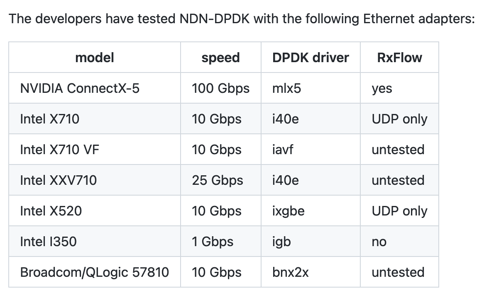

::: {.cell .markdown}

#  Named Data Networking on Fabric

This experiment explores using NDN Data Plane Development on Fabric.  The DPDK was developed at NIST and designed to work on commodity hardware...

This experiment runs on the [FABRIC JupyterHub server](https://jupyter.fabric-testbed.net/). You will need an account on FABRIC, and you will need to have set up bastion keys, to run it.

It should take about 60-120 minutes to run this experiment.

:::

## Run my experiment

:::

::: {.cell .markdown}

### Set up bastion keys

As a first step, set up your personal variables.  Do this before attempting to reserve resources. It's important that you get the variables right *before* you import the `fablib` library, because `fablib` loads these once when imported and they can't be changed afterwards.

* project ID: in the FABRIC portal, click on User Profile > My Roles and Projects > and click on your project name. Then copy the Project ID string.
* bastion username: look for the string after "Bastion login" on [the SSH Keys page in the FABRIC portal](https://portal.fabric-testbed.net/experiments#sshKeys)
* bastion key pair: if you haven't yet set up bastion keys in your notebook environment (for example, in a previous session), complete the steps described in the [bastion keypair](https://github.com/fabric-testbed/jupyter-examples/blob/master//fabric_examples/fablib_api/bastion_setup.ipynb) notebook. Then, the key location you specify below should be the path to the private key file.

If you have set this up, move on to the following:
:::

### Specifying Your Details
Add your unique Fabric credentials that you just set up.

::: {.cell .code}

```python
import os

# Import the python os library
import os

# Specify your project ID
os.environ['FABRIC_PROJECT_ID']='6ce270de-788d-4e07-8bae-3206860a6387'

# Set your Bastion username
os.environ['FABRIC_BASTION_USERNAME']='gsinkins_0000025334'

# Specify the path to your Bastion key, Slice private and public keys
os.environ['FABRIC_BASTION_KEY_LOCATION']=os.environ.get('HOME')+'/work/fabric_config/fabric_bastion_key'
os.environ['FABRIC_SLICE_PRIVATE_KEY_FILE']=os.environ['HOME']+'/work/fabric_config/slice_key'
os.environ['FABRIC_SLICE_PUBLIC_KEY_FILE']=os.environ['HOME']+'/work/fabric_config/slice_key.pub'

# Prepare to share these with Bash so we can write the SSH config file
os.environ['FABRIC_BASTION_HOST'] = 'bastion-1.fabric-testbed.net'
FABRIC_BASTION_USERNAME = os.environ['FABRIC_BASTION_USERNAME']
FABRIC_BASTION_KEY_LOCATION = os.environ['FABRIC_BASTION_KEY_LOCATION']
FABRIC_SLICE_PRIVATE_KEY_FILE = os.environ['FABRIC_SLICE_PRIVATE_KEY_FILE']
FABRIC_BASTION_HOST = os.environ['FABRIC_BASTION_HOST']
```
:::

### Using the variables set above, run the following bash commands
::: {.cell .code}

```bash
%%bash -s "$FABRIC_BASTION_USERNAME" "$FABRIC_BASTION_KEY_LOCATION" "$FABRIC_SLICE_PRIVATE_KEY_FILE"
# Set permissions for the key location and private slice file
chmod 600 $2 $3

export FABRIC_BASTION_SSH_CONFIG_FILE=${HOME}/work/fabric_config/ssh_config

echo "Host bastion-*.fabric-testbed.net"    >  ${FABRIC_BASTION_SSH_CONFIG_FILE}
echo "     User $1"                         >> ${FABRIC_BASTION_SSH_CONFIG_FILE}
echo "     IdentityFile $2"                 >> ${FABRIC_BASTION_SSH_CONFIG_FILE}
echo "     StrictHostKeyChecking no"        >> ${FABRIC_BASTION_SSH_CONFIG_FILE}
echo "     UserKnownHostsFile /dev/null"    >> ${FABRIC_BASTION_SSH_CONFIG_FILE}


cat ${FABRIC_BASTION_SSH_CONFIG_FILE}
```
:::


::: {.cell .markdown} 

### Reserve resources
TODO: Determine the best site, or choose random if all equal

Give your slice a unique name. You can also set the FABRIC site at which you want to reserve resources in the cell below:
:::

::: {.cell .code}

```python
SLICENAME=os.environ['FABRIC_BASTION_USERNAME'] + "-fabric-ndn"
SITE="UCSD"
```

:::

::: {.cell .markdown}
Now we are ready to import fablib! And we'll use it to see what resources are available at FABRIC sites.
:::


::: {.cell .code}

```python
import json
import traceback
from fabrictestbed_extensions.fablib.fablib import fablib
```
:::

::: {.cell .markdown}
If you already have the resources for this experiment (for example: you ran this part of the notebook previously, and are now returning to pick off where you left off), you don't need to reserve resources again. If the following cell tells you that you already have resources, you can just skip to the part where you left off last.
:::


::: {.cell .code}

```python
if fablib.get_slice(SLICENAME):
    print("You already have a slice named %s." % SLICENAME)
    slice = fablib.get_slice(name=SLICENAME)
    print(slice)
```
:::


::: {.cell .markdown}
This section needs developing.  It appears as though Fabric has NVDIA ConnectX-5 
and ConnectX-6 Ethernet adapters.  NDN-DPDK has been tested on the ConnectX-5 but at
100 Gps rate...Fabric offers the ConnectX-5 at the 10 Gbps rate, so I've choosen the
ConnectX-6 since it specifies 100Gbps.


Here's an image of what has been tested with DPDK:


more can be read here: https://github.com/usnistgov/ndn-dpdk/blob/main/docs/hardware.md

For the nodes, I referenced the CPU and Memory section of the Hardware Guide.
> The developers have tested NDN-DPDK on servers with one, two, and four NUMA sockets.
>
> Default configuration of NDN-DPDK requires at least 6 CPU cores (total) and 8 GB hugepages memory (per NUMA socket). With a custom configuration, NDN-DPDK might work on 2 CPU cores and 2 GB memory, albeit at reduced performance; see performance tuning "lcore allocation" and "memory usage insights" for some hints on how to do so.

:::

::: {.cell .code}

```python
try:
    slice = fablib.new_slice(name='fabric-ndn')

    # ndn1
    ndn1 = slice.add_node(name="ndn1", site=SITE, cores=6, ram=64, disk=100, image='default_ubuntu_20')
    ndn1_interface = ndn1.add_component(model="NIC_Basic", name='-nic').get_interfaces()[0]

    # ndn2 (will eventually be on a separate site)
    ndn2 = slice.add_node(name="ndn2", site=SITE, cores=6, ram=64, disk=100,image='default_ubuntu_20')
    ndn2_interface = ndn2.add_component(model="NIC_Basic", name='-nic').get_interfaces()[0]

    # Forwarder
    fwdr = slice.add_node(name="fwdr", site=SITE, cores=6, ram=64, disk=100, image='default_ubuntu_20')
    fwdr_if1 = fwdr.add_component(model="NIC_Basic", name='-if1').get_interfaces()[0]
    fwdr_if2 = fwdr.add_component(model="NIC_Basic", name='-if2').get_interfaces()[0]

    # Networks
    net1 = slice.add_l2network(name='net1', type='L2Bridge', interfaces=[ndn1_interface,fwdr_if1])
    net2 = slice.add_l2network(name='net_2', type='L2Bridge', interfaces=[ndn2_interface,fwdr_if2])


    slice.submit()

except Exception as e:
```
:::

::: {.cell .markdown}
## Slice Status
When the slice is ready, the Slice state will be listed as StableOK
:::

::: {.cell .code}

```python
print(f"{slice}")
```
:::

::: {.cell .markdown}
## Get Login Details
To get the log in details for each node, run the following:
::: 

::: {.cell .code}

```python
for node in slice.get_nodes():
    print(f"{node}")
```
:::

::: {.cell .markdown}

## Gather ssh Details and Set Environment Variables

### variables specific to this slice
:::


::: {.cell .code}

```python
NDN1_IP = str(slice.get_node("ndn1").get_management_ip())
NDN1_USER =  str(slice.get_node("ndn1").get_username())
NDN1_if_FWDR = slice.get_node("ndn1").get_interfaces()[0].get_os_interface()

```
:::

::: {.cell .markdown}


## Delete slice

:::

::: {.cell .markdown}


When you are finished, delete your slice to free resources for other experimenters.


:::


::: {.cell .code}

```python
fablib.delete_slice(SLICENAME)
```

:::